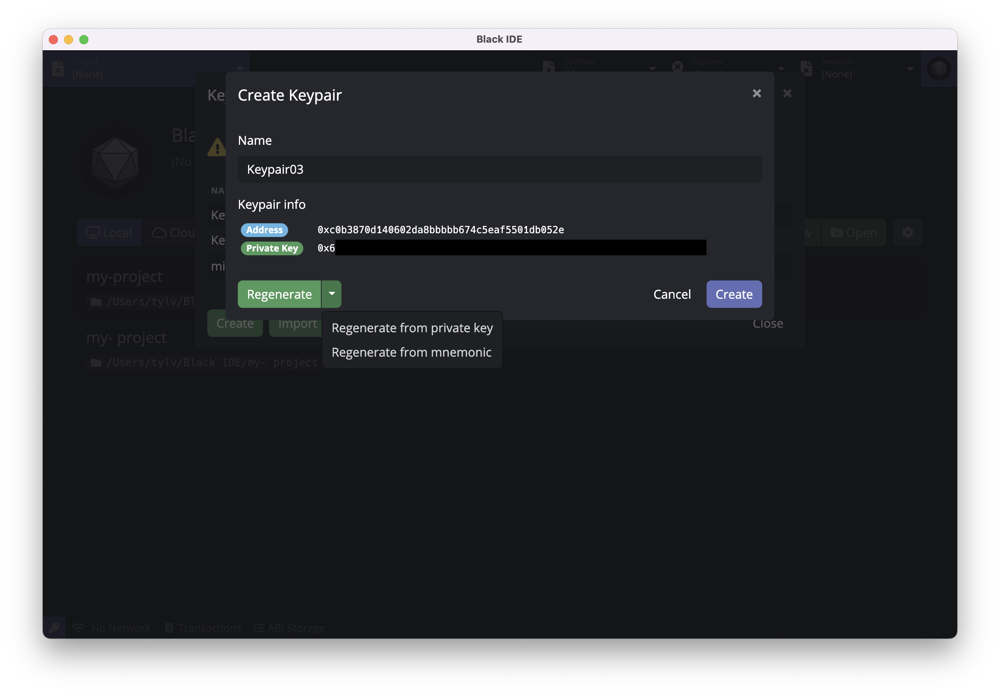
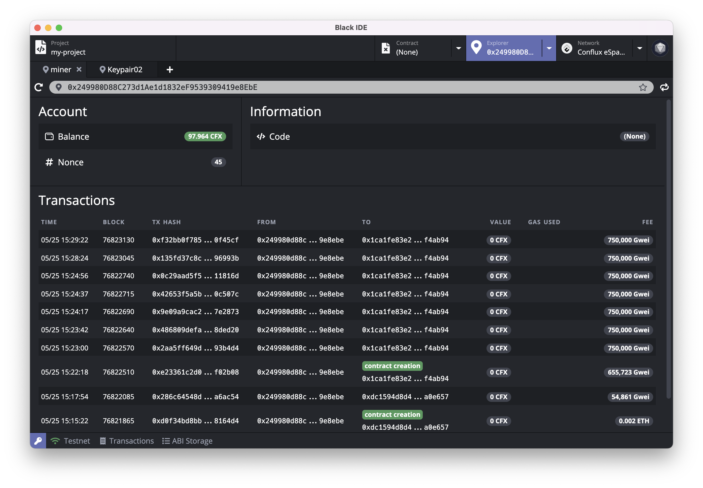
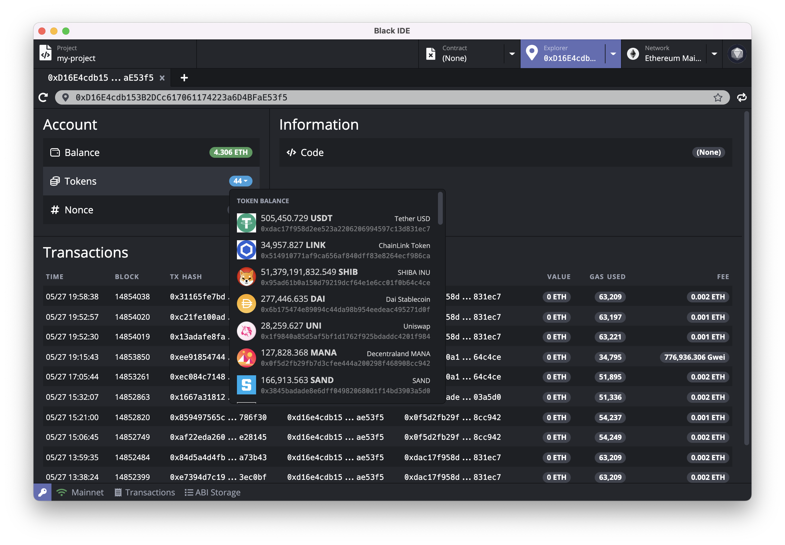
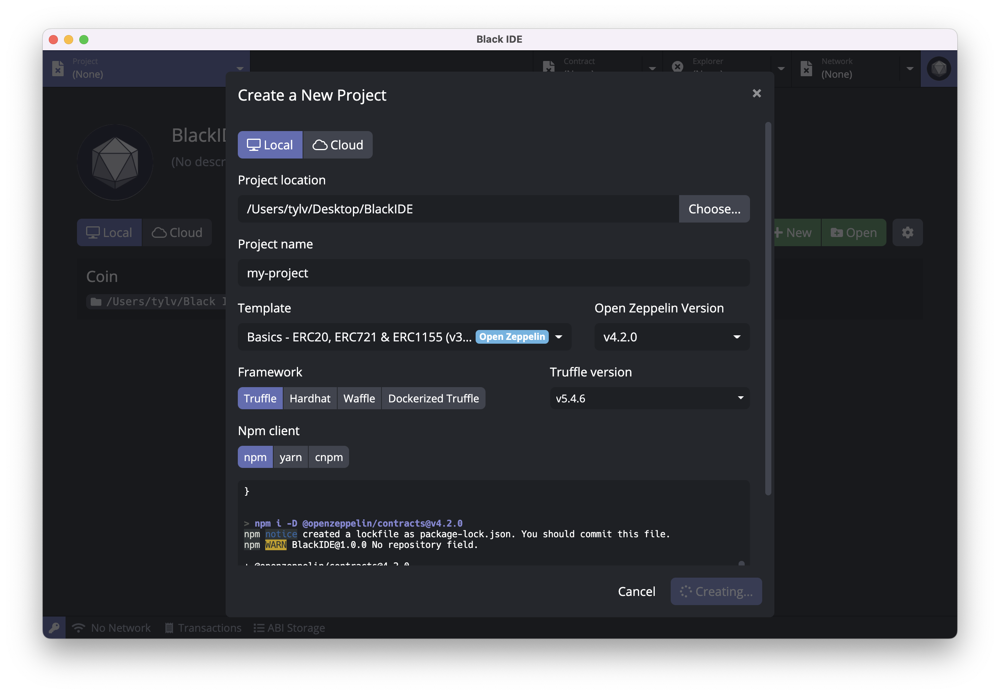
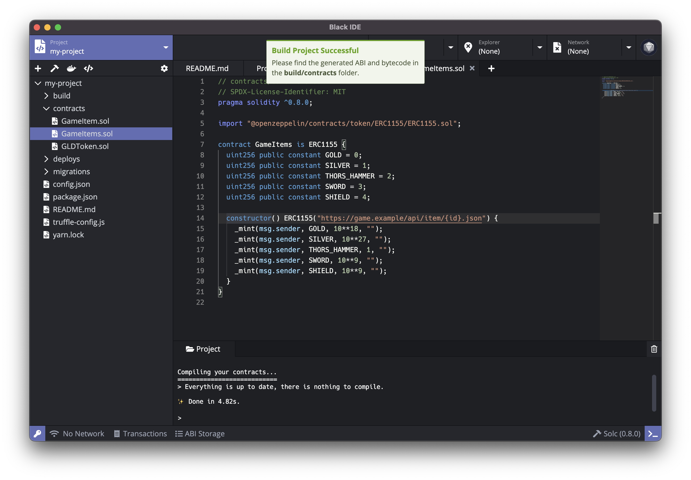
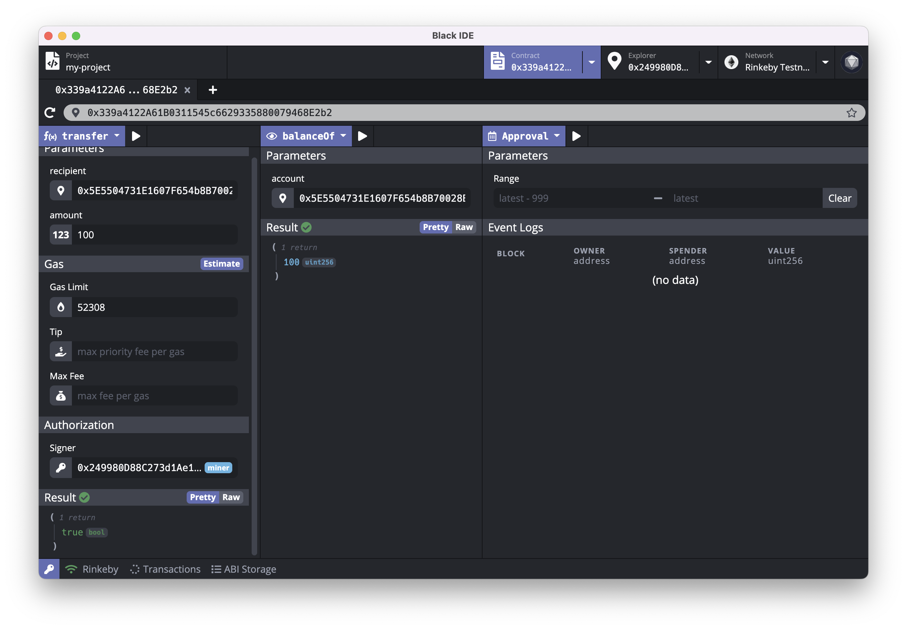
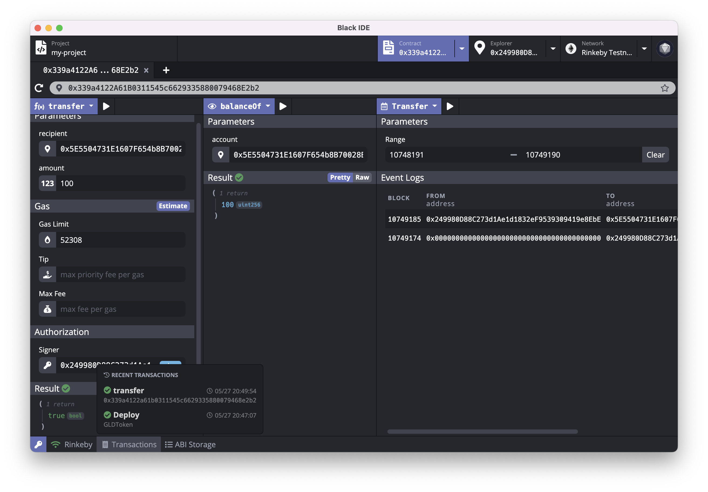

# Ethereum Studio

[点击查看简体中文版](https://github.com/ObsidianLabs/EthereumStudio/blob/master/README-CN.md)

Ethereum Studio is an integrated development environment (IDE), making developing [Ethereum](https://ethereum.org/) smart contracts faster and easier. Ethereum Studio currently offers a standalone destkop application running on macOS, Windows and Linux, as well as [Ethereum Studio Web](https://eth.ide.black) that runs in modern web browsers.

<p align="center">
  
</p>

## Getting Started with Ethereum Studio

### Installing Ethereum Studio Desktop

Download Ethereum Studio installation package in [Github Release](https://github.com/ObsidianLabs/EthereumStudio/releases) according to the computer system type ( `.dmg` for macOS, `.AppImage` for Linux, `.exe` for Windows ).

- **macOS**: Double click to open `EthereumStudio-x.x.x.dmg` and drag `Ethereum Studio` to the application folder.
  - In case system prompts *"Cannot open Ethereum Studio, because Apple cannot inspect if it's malicious."* , Open *System Perference* , Go to *Security and Privacy* . Click *Open Anyway* in *General* section to allow Ethereum Studio to run.
- **Linux**: Double-click to open `EthereumStudio-x.x.x.AppImage`
  - If application doesn't respond,double click to select *Properties* => *Permissions* => *Execute*, and tick the *Allow executing file as progrom* option. Close the properties window and double-click to open the application (different Linux distributions may have different installation methods).
- **Windows**:  Double click to run the `EthereumStudio-x.x.x.exe`.

### Post-installation steps for Linux

EthereumStudio Studio uses `inotify` by default on Linux to monitor directories for changes. Users will need to increase the amount of inotify watchers to ensure the filetree is refreshed properly.

To increase inotify watchers at boot, execute the following command in Terminal:

```
echo fs.inotify.max_user_watches=524288 | sudo tee -a /etc/sysctl.conf && sudo sysctl -p
```

### Accessing Ethereum Studio Web

Open https://eth.ide.black in your browser to access Ethereum Studio Web.

## Feature Walkthrough

The following demo runs on Ethereum Studio v0.8.0 for macOS. All screenshots are for demonstration purposes only. Actual user interfaces might differ.

### Prerequisites

When Ethereum Studio is properly installed and started for the first time, users will see a welcome page, where the dependencies for Ethereum are displayed, including Docker, Ethereum Node and Ethereum Truffle. Ethereum Studio Web does not have any local prerequisitie, simply visit https://eth.ide.black to start.

<p align="center">
  
</p>

- [**Docker**](https://www.docker.com/) is used to to start the Ethereum Node and compile projects in Ethereum Studio. If Docker is not installed yet, users can click the *Install Docker* button to visit the official Docker website and download and install it.
- [**Geth in Docker**](https://github.com/ethereum/go-ethereum) is the Ethereum node image. Ethereum Studio uses the image to run the Ethereum node and compile projects.
- [**Truffle in Docker**](https://github.com/trufflesuite/truffle) is a Ethereum version of truffle used to create and compile projects.

When all the dependencies are properly installed and run, the gray *Skip* button will change into a violet *Get Started* button. Click the button to enter the main interface of Ethereum Studio.

### Keypair Manager

After entering the main interface, users need to create some keypairs. Open Keypair Manager by clicking the key icon at the bottom left on any interface of Ethereum Studio.

<p align="center">
  
</p>

Users can create, import and manage keypairs in the keypair manager. Click *Create* button and follow the prompts to key in a name and create a keypair. When creating or editing a keypair, users can set an alias for the keypair identification purpose in later use. Ethereum Studio creates new keypair with a private key by default but mnemonic is also supported. Simply click on the arrow next to *Regenerate* button and select from the drop-down list.

<p align="center">
  
</p>

In case of importing keypairs, click *Import* button on the bottom-left and put in the private key / mnemonic you want to import. Ethereum Studio will automatically parse it and the corresponding address will be indicated below if the key deemed valid. Click *Import* again to complete the process.

<p align="center">
  
</p>

Before we proceed, please create a few keypairs in the Keypair Manager. We'll be using three keypairs in the following demos, namely  `miner` , `my-keypair-1`  , `my-keypair-2` .

**Please note: private key and mnemonic exclusively prove ownership of a keypair.Please securely store it and DO NOT share with others under any circumstances. Leaking or losing private key or mnemonic may lead to permanent loss of digital asset.**

### Network Manager

#### Local Ethereum Node

Click *Network* tab to switch to Network Manager. Users can manage Ethereum nodes and Geth installation, including installing, deleting Geth images, or create, delete and run Ethereum node with a specific version of Geth.

Click *New Instance* button on the top-right corner to pull up the new instance (node) wizard, then key in a name for the node and specify the version for the underlying Geth, and the address of Miner. Finally click *Create* to complete the process.

When create an Ethereum node, user need to specify a Miner from the keypairs stored in Keypair Manager. Miner mines blocks locally for the Ethereum node. Here, we pick `miner` keypair in our demo, which will also be the genesis address and thus will be issued some tokens upon first startup of our local Ethereum node.

<p align="center">
  
</p>

When the node is successfully created, click the green *Start* button to start Ethereum node. Users may also view node log in the log viewer below.

<p align="center">
  
</p>

#### Ethereum Testnet / Mainnet

Ethereum Studio has built-in configuration for connection to three Ethereum testnets [Ropsten](https://github.com/ethereum/ropsten), [Rinkeby](https://www.rinkeby.io/) and [Kovan](https://kovan-testnet.github.io/), as well as the Ethereum mainnet. Click on the arrow net to *Network* tab and select the network you wish to connect from the drop-down list.

<p align="center">
  
</p>

#### Custom Network

Ethereum Studio supports custom network connection. Click on the arrow next to *Network* tab, and select *Custom Network* from the drop-down list. Follow the prompt to put in designated node URL information to connect.

### Block Explorer

When Ethereum node is up and running, click *Explorer* tag on the top-right corner to switch to Block Explorer. Block Explorer provides tool to query information at a given address that usually includes token information and transaction history. 

Click the arrow next to *Explorer* tag, and select the address you would like to query from the drop-down list. Users should now see the information being pulled up on the screen. Meanwhile, user may also manually key in an address to view its corresponding information. Ethereum Studio currently does not support display of transaction history on local Ethereum node. Switching to testnet or mainnet to display transaction history associated with the address.

<p align="center">
  
</p>

Block Explorer will display all holdings of ERC-20 token that are listed in [Trust Wallet](https://github.com/trustwallet/assets/blob/master/blockchains/ethereum/tokenlist.json) at the address when connecting to mainnet.

<p align="center">
  
</p>
For user's convenience, Ethereum Studio's block explorer comes with a few widgets. Invoke it by clicking on the buttons next to the address column:

- Click *Transfer* button to initiate a quick transfer. This transfer widget supports transfer of ETH or any ERC-20 holding in the account to designated recipient. Select the transaction token and key in corresponding parameters, then click *Sign and Push* button to execute. Every transaction will be recorded in the [Transaction History](#Transaction-History) for reference purposes. Now, let's make use of this transfer widget to move 10,000 ETH from `miner` to `my-keypair-1`.

<p align="center">
  
</p>

- When connecting to testnet, a click on *Faucet* button will direct user to the website where he / she can apply for test tokens for development / test purposes. All faucet token are test tokens and have no monetary value.

### Smart Contract Project

#### Create New Project

Click *Project* tag to switch to Project Manager. Then click *New* button on the top-right corner to open create project popup. Select whether user wishes to create a local or cloud project, then key in project name and select the template which will be the base of your project. Ethereum Studio currently offers following templates:

- **Coin**: A simple coin contract template；
- **ERC20 Token**: An ERC-20 token contract template；
- **[Open Zeppelin] Basics**: A set of templates based on [Open Zeppelin](https://openzeppelin.com/) , which includes ERC-20, ERC-721(NFT), ERC-777 and ERC-1155 contract;
- **[Truffle] Metacoin**: Contracted created by Ethereum Truffle. Ethereum Studio does not support deployment of Metacoin contract.

<p align="center">
  
</p>

Ethereum Studio supports to create and manage project out of three common frameworks [Truffle](https://www.trufflesuite.com/truffle), [Hardhat](https://hardhat.org/) and [Waffle](https://ethereum-waffle.readthedocs.io/).

Right now, let's create a new project named `my-project` with Basics template from Open Zeppelin and Truffle framework. Click *Create Project* to start the process. 

We'll stick to this project later in this tutorial as we demo a complete cycle of smart contract development.

#### Project Editor

When the project is successfully created, user will be redirected to Project Editor. Project Editor have a few useful built-in widgets, including file explorer on the left with toolbar above it, code editor to the right and log viewer in the lower half.

<p align="center">
  
</p>
Click the *Project Settings* (gear-shape) icon on the toolbar to open project settings page. Users may view or change project basics, compiler/linter settings, among others.

<p align="center">
  
</p>

Ethereum Studio's project editor has a built-in linter, which automatically check codes and flag for potential warning or errors. Project editor will indicate an exclamation mark on the line that has warning and a red cross mark on the line that has error.

<p align="center">
  
</p>

#### Compile smart contracts

Click *Build* (hammer-shape) button on the toolbar to start compiling the current project. Users may view progress in the log viewer in the lower half of the editor. Outputs will be stored as `*.json` files in `build/contracts` folder under the current project path. Refer to [solc documentation](https://docs.soliditylang.org/en/latest/using-the-compiler.html#output-description) for more details about compiled outputs.

<p align="center">
  
</p>

Users may also trigger compilation of a specfic `.sol` contract by a right click on the file, then select *Compile* from the drop-down menu. 

#### Deploy smart contracts

Click *Deploy* (docker whale) button on the toolbox to open the contract deployment popup. Users may proceed deployment by filling out necessary parameters:

- Compiled Contract: The [compiled contract](https://docs.soliditylang.org/en/latest/using-the-compiler.html#output-description) to be deployed in `.json` format. There might be multiple contracts in single project, choose the proper contract from the drop-down list. Here, we'll be deploying `GLDToken.json` this time;
- Constructor Parameters: Required parameters to construct functions. Ethereum Studio automatically generates parameter form from data structures predefined in the contract, so that users only need to fill the form. Here, click on the initialSupply column and type in 1000;
- Signer: Keypair to sign the deployment transaction. This must be a keypair stored in Keypair Manager. Here, we pick `my-keypair-1` from the drop-down list;
- Gas Limit, Gas Price: Transaction fees for this deployment transaction. Users may leave them blank for Ethereum Studio to estimate on its own or manually override them with your own estimates.

Users may also trigger deployment of a specfic `.json` output by a right click on the file, and select *Deploy* from the drop-down menu. 

<p align="center">
  
</p>

In above example, contract will distribute all 1,000 initial tokens to the signer address `my-keypair-1` upon its receipt of successful deployment. Click *Estimate & Deploy* button, Ethereum Studio will estimate the transaction fee and fill corresponding sections in the form. Hit *Re-estimate* button to redo it. Finally click the violet *Deploy* button to send the deployment transaction. Sometimes, transaction fee might be underestimated which leads to a failed deployment with insufficient transaction fee error. In that case, manually override with a higher Gas Limit and Gas Price and retry deployment. 

Deployment transaction may take some time to be processed by the Ethereum network. Usually a transaction details popup will show up after 10 - 20 seconds. Users may click on tabs to view Parameters, Tx, Receipt and ABI information of the transaction. This popup can be recalled anytime from [Transaction History](#Transaction-History).

<p align="center">

</p>

### Invoke smart contract

After contract is deployed, click the contract address in the Transaction Details popup and user will be redirected to Contract Inspector. Users may also click *Contract* tab to switch to Contract Inspector, and type in the address to open a contract. Ethereum Studio's contract inspector allows user to open and debug multiple contracts at the same time.

Contract Inspector are mainly divided into three parts:
- Write methods on the left: Invoke write methods in the contract by selecting from the violet drop-down list;
- Read data in the middle: Read data as predefined data types in the contract by selecting from the violet drop-down list;
- Query event logs on the right: Query event logs as defined in the contract by selecting from the violet drop-down list.

<p align="center">
  
</p>

Ethereum Studio automatically stores contract ABI after deployment and generate above lists of write methods, data retrieval, event query and their corresponding parameter forms. For more information on ABI, please refer to [ABI Storage](#abi-storage).

Now, let's open the `GLDToken` contract we deployed moments ago to demo how to access contract with Contract Inspector.

First, select *transfer* method from the drop-down list on the left column. *Transfer* method moves a specified amount of token from one address to another. We need to populate the parameter form to complete the transaction:

- Select `my-keypair-2` from the drop-down list as the recipient (manual key-in address is also accepted) and type in 100 for amount as we wish to transfer 100 token in this example;
- Leave all forms in the Gas section to Ethereum Studio to estimate. 
- Select `my-keypair-1` from the drop-down list in the Signer column. This also designate `my-keypair-1` as the sender in this transaction. 

Then click *Execute* (Play) button next to *transfer* to push and execute the transaction. Moments later, ethereum network will prompt messages stating transaction status and fee information.

<p align="center">
  
</p>

Let's proceed by verifying the outcome of last transaction. Select *balanceOf* from drop-down list of data types, then select `my-keypair-2` from the drop-down list in the account column. And finally hit *Execute* (Play) button to read the data. Result will be shown below, which in our example, is 100. This verifies that, above transfer transaction of 100 token to  `my-keypair-2` has been successfully carried out.

<p align="center">
  
</p>

Finally, we pick *Transfer* from the drop-down list of contract events, and click *Get event logs* (Play) button to query all transfer-related events. Results is shown below in the Event Logs section. Ethereum Studio supports customized range for events query, but can only return maximum 10,000 queries when connecting to local nodes or testnets, and by default the most recent 10,000 records. Therefore, users should keep custom range within the aforementioned number. When connecting to Ethereum mainnet, the maximum number of event log query goes down to 1,000.

<p align="center">
  
</p>

#### ABI Storage

When working with Code Inspector, Ethereum Studio relies on contract ABI to generate lists of methods, data types and event types. ABI Storage at the bottom is the place where these ABIs are stored. Upon successful deployment of contract, Ethereum Studio automatically stores contract ABI(s). Users may view the raw ABI data by moving cursor onto the ABI record and click *Edit* (pencil) icon, or click *Delete* button to remove the ABI record.

<p align="center">
  
</p>

In case when users need to access other contracts (a online contract, for example), he/she needs to add the contract ABI to ABI Storage. Click *New* button in the ABI Storage popup tostart the process. For users' convenience, Ethereum Studio also reads ABI from all compiled contracts in the current project. Click *Select from the current project* and select to import ABI from the drop-down list.

<p align="center">
  
</p>

#### Transaction History

Ethereum Studio records every transaction pushed to network. To view recent transactions, click *Transactions* tab to pull up the list of transactions. Users may single click on a transaction to pull up Transaction Details popup and review information such as Basics, Parameters, Tx and Receipt.

<p align="center">
  
</p>

#### RPC Client

Ethereum Studio also comes with a RPC client allowing users to interact with Ethereum nodes on the low-level and examine the raw data. Click the network name tab at the bottom and select *RPC Client* from the drop-down list to pull up RPC Client popup. RPC Clients supports all Ethereum RPC methods. Select from the drop-down list to start, and Ethereum Studio will generate corresponding parameter form automatically. Fill out necessary parameters and hit *Execute* button to call the method and view response in the Result section.

<p align="center">
  
</p>
