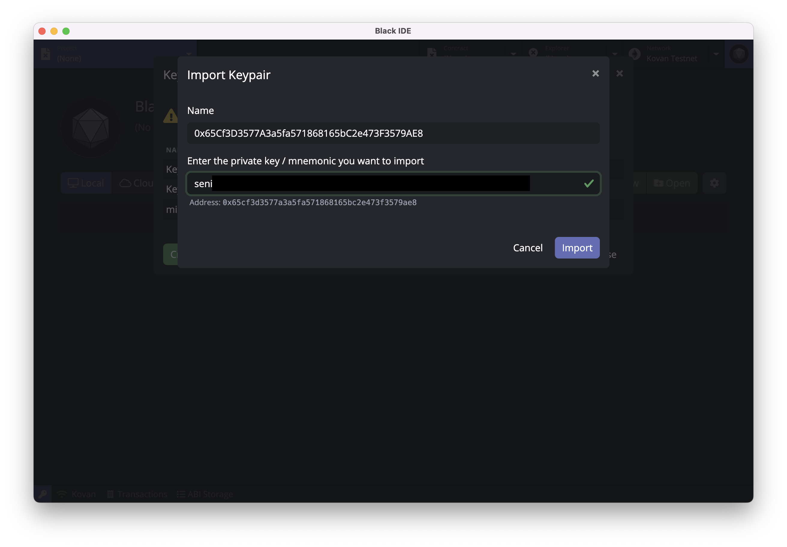
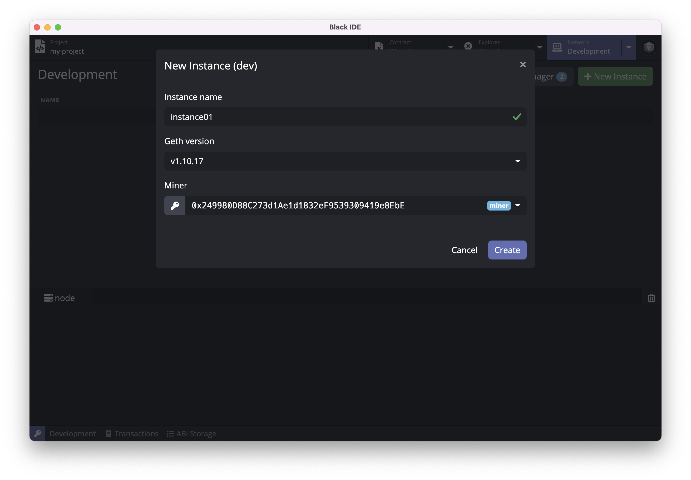
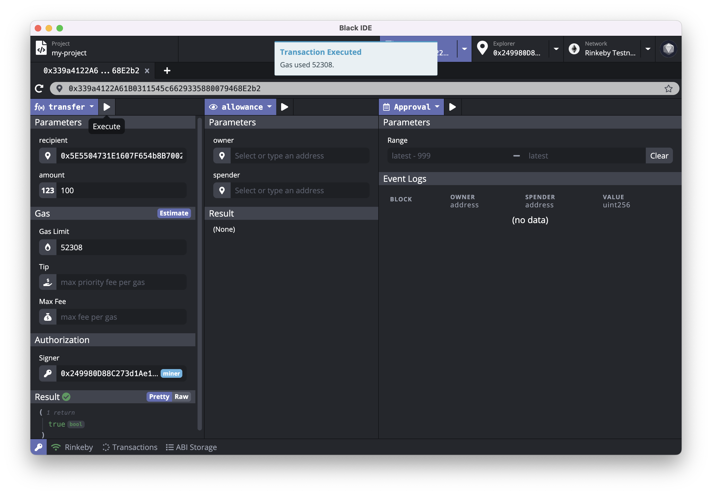
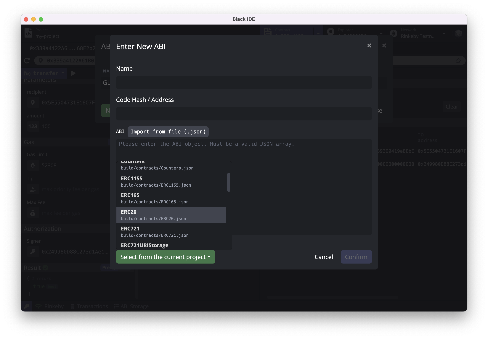

# Black IDE

[点击查看简体中文版](https://github.com/ObsidianLabs/Black-IDE/blob/master/README-CN.md)

Black IDE is an integrated development environment (IDE), making developing [Ethereum](https://ethereum.org/) smart contracts faster and easier. Black IDE currently offers a standalone desktop application running on macOS, Windows and Linux, as well as [Black IDE Web](https://eth.ide.black) that runs in modern web browsers.

<p align="center">
  
</p>

## Getting Started with Black IDE

### Installing Black IDE Desktop

Download Black IDE installation package in [Github Release](https://github.com/ObsidianLabs/Black-IDE/releases) according to the computer system type ( `.dmg` for macOS, `.AppImage` for Linux, `.exe` for Windows ).

- **macOS**: Double click to open `Black-IDE-x.x.x.dmg` and drag `Black IDE` to the application folder.
  - In case of system prompts _"“Black IDE” can’t be opened because Apple cannot check it for malicious software."_, Open _System Perference_, Go to _Security and Privacy_, Click _Open Anyway_ in _General_ section to allow Black IDE to run.
- **Linux**: Double-click to open `Black-IDE-x.x.x.AppImage`
  - If application doesn't respond,double click to select _Properties_ => _Permissions_ => _Execute_, and tick the _Allow executing file as program_ option. Close the properties window and double-click to open the application (different Linux distributions may have different installation methods).
- **Windows**: Double click to run the `Black-IDE-x.x.x.exe`.

### Post-installation steps for Linux

Black IDE uses `inotify` by default on Linux to monitor directories for changes. Users will need to increase the amount of inotify watchers to ensure the file tree is refreshed properly.

To increase inotify watchers at boot, execute the following command in Terminal:

```
echo fs.inotify.max_user_watches=524288 | sudo tee -a /etc/sysctl.conf && sudo sysctl -p
```

### Accessing Black IDE Web

Open https://eth.ide.black in your browser to access Black IDE Web.

## Feature Walkthrough

The following demo runs on Black IDE v0.8.0 for macOS. All screenshots are for demonstration purposes only. Actual user interfaces might differ.

### Prerequisites

When Black IDE is properly installed and started for the first time, users will see a welcome page, where the dependencies for Ethereum are displayed, including Docker, Ethereum Node and Ethereum Truffle. Black IDE Web does not have any local prerequisite, simply visit https://eth.ide.black to start.

<p align="center">
  
</p>

- [**Docker**](https://www.docker.com/) is used to start the Ethereum Node and compile projects in Black IDE. If Docker is not installed yet, users can click the _Install Docker_ button to visit the official Docker website and download and install it.
- [**Geth in Docker**](https://github.com/ethereum/go-ethereum) is the Ethereum node image. Black IDE uses the image to run the Ethereum node and compile projects.
- [**Truffle in Docker**](https://github.com/trufflesuite/truffle) is an Ethereum version of truffle used to create and compile projects.

When all the dependencies are properly installed and run, the gray _Skip_ button will change into a violet _Get Started_ button. Click the button to enter the main interface of Black IDE.

### Keypair Manager

After entering the main interface, users need to create some keypairs. Open Keypair Manager by clicking the key icon at the bottom left on any interface of Black IDE.

<p align="center">
  
</p>

Users can create, import and manage keypairs in the keypair manager. Click _Create_ button and follow the prompts to key in a name and create a keypair. When creating or editing a keypair, users can set an alias for the keypair identification purpose in later use. Black IDE creates new keypairs with private keys by default but mnemonic is also supported. Simply click on the arrow next to _Regenerate_ button and select from the drop-down list.

<p align="center">
  
</p>

In case of importing keypairs, click _Import_ button on the bottom-left and put in the private key / mnemonic you want to import. Black IDE will automatically parse it and the corresponding address will be indicated below if the key is deemed valid. Click _Import_ again to complete the process.

<p align="center">
  
</p>

Before we proceed, please create a few keypairs in the Keypair Manager. We'll be using three keypairs in the following demos, namely `miner` , `keypair01` , `keypair02` .

**Please note: private keys and mnemonics exclusively prove ownership of a keypair. Please securely store them and DO NOT share them with others under any circumstances. Leaking or losing private keys or mnemonics may lead to permanent loss of digital assets.**

### Network Manager

#### Local Ethereum Node

Click _Network_ tab to switch to Network Manager. Users can manage Ethereum nodes and Geth installation, including installing, deleting Geth images, or create, delete and run Ethereum node with a specific version of Geth.

Click _New Instance_ button on the top-right corner to pull up the new instance (node) wizard, then key in a name for the node and specify the version for the underlying Geth, and the address of Miner. Finally, click _Create_ to complete the process.

When creating an Ethereum node, users need to specify a Miner from the keypairs stored in Keypair Manager. Miner mines block locally for the Ethereum node. Here, we pick `miner` keypair in our demo, which will also be the genesis address and thus will be issued some tokens upon the first startup of our local Ethereum node.

<p align="center">
  
</p>

When the node is successfully created, click the green _Start_ button to start Ethereum node. Users may also view node log in the log viewer below.

<p align="center">
  
</p>

#### Ethereum Testnet / Mainnet

Black IDE has built-in configurations for connection to three Ethereum testnets [Ropsten](https://github.com/ethereum/ropsten), [Rinkeby](https://www.rinkeby.io/) and [Kovan](https://kovan-testnet.github.io/), as well as the Ethereum mainnet. Click on the arrow net to _Network_ tab and select the network you wish to connect from the drop-down list.

<p align="center">
  
</p>

#### Custom Network

Black IDE supports custom network connections. Click on the arrow next to _Network_ tab, and select _Custom Network_ from the drop-down list. Follow the prompt to put in designated node URL information to connect.

### Block Explorer

When Ethereum node is up and running, click _Explorer_ tag on the top-right corner to switch to Block Explorer. Block Explorer provides a tool to query information at a given address that usually includes token information and transaction history.

Click the arrow next to _Explorer_ tag, and select the address you would like to query from the drop-down list. Users should now see the information being pulled up on the screen. Meanwhile, users may also manually key in an address to view its corresponding information. Black IDE currently does not support display of transaction history on local Ethereum nodes. Switching to testnet or mainnet to display transaction history associated with the address.

<p align="center">
  
</p>

Block Explorer will display all holdings of ERC-20 tokens that are listed in [Trust Wallet](https://github.com/trustwallet/assets/blob/master/blockchains/ethereum/tokenlist.json) at the address when connecting to mainnet.

<p align="center">
  
</p>
For user's convenience, Black IDE's block explorer comes with a few widgets. Invoke it by clicking on the buttons next to the address column:

- Click _Transfer_ button to initiate a quick transfer. This transfer widget supports transfer(s) of ETH or any ERC-20 holding in the account to a designated recipient. Select the transaction token and key in corresponding parameters, then click _Sign and Push_ button to execute. Every transaction will be recorded in the [Transaction History](#Transaction-History) for reference purposes. Now, let's make use of this transfer widget to move 10,000 ETH from `miner` to `keypair01`.

<p align="center">
  
</p>

- When connecting to testnet, a click on _Faucet_ button will direct user to the website where he / she can apply for test tokens for development / test purposes. All faucet tokens are test tokens and have no monetary value.

### Smart Contract Project

#### Create New Project

Click _Project_ tag to switch to Project Manager. Then click _New_ button on the top-right corner to open create project popup. Select whether user wishes to create a local or cloud project, then key in a project name and select the template which will be the base of your project. Black IDE currently offers the following templates:

- **Coin**: A simple coin contract template；
- **ERC20 Token**: An ERC-20 token contract template；
- **[Open Zeppelin] Basics**: A set of templates based on [Open Zeppelin](https://openzeppelin.com/) , which includes ERC-20, ERC-721(NFT), ERC-777 and ERC-1155 contract;
- **[Truffle] Metacoin**：Contract templates created by Ethereum Truffle. Black IDE currently does not support deploying Metacoin contracts.

<p align="center">
  
</p>

Black IDE supports to create and manage projects out of three common frameworks [Truffle](https://www.trufflesuite.com/truffle), [Hardhat](https://hardhat.org/) and [Waffle](https://ethereum-waffle.readthedocs.io/).

Right now, let's create a new project named `my-project` with Basics template from Open Zeppelin and Truffle framework. Click _Create Project_ to start the process.

We'll stick to this project later in this tutorial as we demo a complete cycle of smart contract development.

#### Project Editor

When the project is successfully created, users will be redirected to Project Editor. Project Editor has a few useful built-in widgets, including file explorer on the left with a toolbar above it, code editor to the right and log viewer in the lower half.

<p align="center">
  
</p>

Click the _Project Settings_ (gear-shape) icon on the toolbar to open project settings page. Users may view or change project basics, compiler/linter settings, among others.

<p align="center">
  
</p>

Black IDE's project editor has a built-in linter, which automatically checks codes and flag for potential warnings or errors. Project editor will indicate an exclamation mark on the line that has warnings and a red cross mark on the line that has errors.

<p align="center">
  
</p>

#### Compile smart contracts

Click _Build_ (hammer-shaped) button on the toolbar to start compiling the current project. Users may view progress in the log viewer in the lower half of the editor. Outputs will be stored as `*.json` files in `build/contracts` folder under the current project path. Refer to [solc documentation](https://docs.soliditylang.org/en/latest/using-the-compiler.html#output-description) for more details about compiled outputs.

<p align="center">
  
</p>

Users may also trigger compilation of a specific `.sol` contract by a right-click on the file, then select _Compile_ from the drop-down menu.

#### Deploy smart contracts

Click _Deploy_ (docker whale) button on the toolbox to open the contract deployment popup. Users may proceed with deployment by filling out all necessary parameters:

- Compiled Contract: The [compiled contract](https://docs.soliditylang.org/en/latest/using-the-compiler.html#output-description) to be deployed in `.json` format. There might be multiple contracts in a single project, choose the proper contract from the drop-down list. Here, we'll be deploying `GLDToken.json` this time;
- Constructor Parameters: Required parameters to construct functions. Black IDE automatically generates parameter form from data structures predefined in the contract, so that users only need to fill the form. Here, click on the initialSupply column and type in 1000;
- Signer: Keypair to sign the deployment transaction. This must be a keypair stored in Keypair Manager. Here, we pick `keypair01` from the drop-down list;
- Gas Limit, Gas Price: Transaction fees for this deployment transaction. Users may leave them blank for Black IDE to estimate on its own or manually override them with your estimates.

Users may also trigger deployment of a specific `.json` output by a right-click on the file, and select _Deploy_ from the drop-down menu.

<p align="center">
  
</p>

In the above example, the `GLDToken` contract will distribute all 1,000 initial tokens to the signer address `keypair01` upon its receipt of successful deployment. Click _Estimate & Deploy_ button, Black IDE will estimate the transaction fee and fill corresponding sections in the form. Hit _Re-estimate_ button to redo it. Finally, click the violet _Deploy_ button to send the deployment transaction. Sometimes, transaction fees might be underestimated which leads to a failed deployment with insufficient transaction fee error. In that case, manually override with a higher Gas Limit and Gas Price and retry deployment.

Deployment transaction(s) may take some time to be processed by the Ethereum network. Usually, a transaction details popup will show up after 10 - 20 seconds. Users may click on tabs to view Parameters, Tx, Receipt and ABI information of the transaction. This popup can be recalled anytime from [Transaction History](#Transaction-History).

<p align="center">

</p>

### Invoke smart contract

After the contract is deployed, click the contract address in the Transaction Details popup and user will be redirected to Contract Inspector. Users may also click _Contract_ tab to switch to Contract Inspector and type in the address to open a contract. Black IDE's contract inspector allows users to open and debug multiple contracts at the same time.

Contract Inspector is mainly divided into three parts:

- Write methods on the left: Invoke write methods in the contract by selecting from the violet drop-down list;
- Read data in the middle: Read data as predefined data types in the contract by selecting from the violet drop-down list;
- Query event logs on the right: Query event logs as defined in the contract by selecting from the violet drop-down list.

<p align="center">
  
</p>

Black IDE automatically stores contract ABI after deployment and generates above lists of write methods, data retrieval, event query and their corresponding parameter forms. For more information on ABI, please refer to [ABI Storage](#abi-storage).

Now, let's open the `GLDToken` contract we deployed moments ago to demo how to access the contract with Contract Inspector.

First, select _transfer_ method from the drop-down list on the left column. _Transfer_ method moves a specified amount of tokens from one address to another. We need to populate the parameter form to complete the transaction:

- Select `keypair02` from the drop-down list as the recipient (manual key-in address is also accepted) and type in 100 for amount as we wish to transfer 100 token in this example;
- Leave all forms in the Gas section to Black IDE to estimate.
- Select `keypair01` from the drop-down list in the Signer column. This also designates `keypair01` as the sender in this transaction.

Then click _Execute_ (Play) button next to _transfer_ to push and execute the transaction. Moments later, Ethereum Network will prompt messages stating transaction status and fee information.

<p align="center">
  
</p>

Let's proceed by verifying the outcome of last transaction. Select _balanceOf_ from the drop-down list of data types, then select `keypair02` from the drop-down list in the account column. And finally hit _Execute_ (Play) button to read the data. The result will be shown below, which in our example, is 100. This verifies that the above transfer transaction of 100 tokens to `keypair02` has been successfully carried out.

<p align="center">
  
</p>

Finally, we pick _Transfer_ from the drop-down list of contract events and click _Get event logs_ (Play) button to query all transfer-related events. Results are shown below in the Event Logs section. Black IDE supports a customized range for events query, but can only return maximum 10,000 queries when connecting to local nodes or testnets, and by default the most recent 10,000 records. Therefore, users should keep the custom range within the aforementioned number. When connecting to Ethereum mainnet, the maximum number of event log queries goes down to 1,000.

<p align="center">
  
</p>

#### ABI Storage

When working with Code Inspector, Black IDE relies on contract ABI to generate lists of methods, data types and event types. ABI Storage at the bottom is the place where these ABIs are stored. Upon successful deployment of contract, Black IDE automatically stores contract ABI(s). Users may view the raw ABI data by moving the cursor onto the ABI record and click _Edit_ (pencil) icon, or click _Delete_ button to remove the ABI record.

<p align="center">
  
</p>

In case when users need to access other contracts (an online contract, for example), he/she needs to add the contract ABI to ABI Storage. Click _New_ button in the ABI Storage popup to start the process. For users' convenience, Black IDE also reads ABI from all compiled contracts in the current project. Click _Select from the current project_ and select to import ABI from the drop-down list.

<p align="center">
  
</p>

#### Transaction History

Black IDE records every transaction pushed to the network. To view recent transactions, click _Transactions_ tab to pull up the list of transactions. Users may single click on a transaction to pull up Transaction Details popup and review information such as Basics, Parameters, Tx and Receipt.

<p align="center">
  
</p>

#### RPC Client

Black IDE also comes with an RPC client allowing users to interact with Ethereum nodes on the low level and examine the raw data. Click the network name tab at the bottom and select _RPC Client_ from the drop-down list to pull up RPC Client popup. RPC Clients supports all Ethereum RPC methods. Select from the drop-down list to start, and Black IDE will generate the corresponding parameter form automatically. Fill out necessary parameters and hit _Execute_ button to call the method and view the response in the Result section.

<p align="center">
  
</p>
