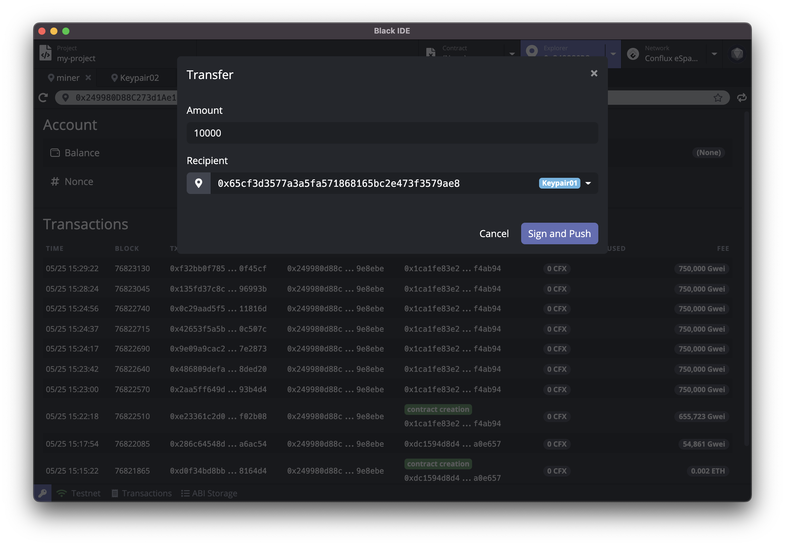

# Ethereum Studio

Ethereum Studio is an integrated development environment (IDE), making developing [Ethereum](https://ethereum.org/) smart contracts faster and easier.


English | [简体中文](https://github.com/ObsidianLabs/EthereumStudio/blob/master/README-CN.md)
## Installation

### Download

Download Ethereum Studio install-package in [Github Release](https://github.com/ObsidianLabs/EthereumStudio/releases) according to the computer system type (.dmg/.zip for macOS, .AppImage for Linux, .exe for Windows).

### Install


- **macOS**: Double click to open `EthereumStudio-x.x.x.dmg` and drag `Ethereum Studio` to the application folder.
- **Linux**: Double-click to open `EthereumStudio-x.x.x.AppImage`, select *Properties* => *Permissions* => *Execute*, and tick the *Allow executing file as progrom* option. Close the properties window and double-click to open the application (different Linux distributions may have different installation methods).
- **Windows**: Double click to run the `EthereumStudio-x.x.x.exe`.

### Post-installation steps for Linux

EthereumStudio Studio uses `inotify` by default on Linux to monitor directories for changes. You will need to increase the amount of inotify watchers to ensure the filetree is refreshed properly.

To increase inotify watchers at boot, execute the following command in Terminal:

```
echo fs.inotify.max_user_watches=524288 | sudo tee -a /etc/sysctl.conf && sudo sysctl -p
```

## Feature Walkthrough

### Prerequisites

When Ethereum Studio is properly installed and started for the first time, users will see a welcome page, where the dependencies for Ethereum are displayed, including Docker, Ethereum Node and Ethereum Truffle.

<p align="center">
  
</p>

- [**Docker**](https://www.docker.com/) is used to to start the Ethereum Node and compile projects in Ethereum Studio. If Docker is not installed yet, users can click the *Install Docker* button to visit the official Docker website and download and install it.
- [**Geth in Docker**](https://hub.docker.com/repository/docker/obsidians/geth) is the Ethereum node image. Ethereum Studio uses the image to run the Ethereum node and compile projects.
- [**Truffle in Docker**](https://hub.docker.com/repository/docker/obsidians/truffle) is a Ethereum version of truffle used to create and compile projects.

When all the dependencies are properly installed and run, the gray *Skip* button will change into a green *Get Started* button. Click the button to enter the main interface of Ethereum Studio.

### Create Keypairs

After entering the main interface, users need to create some keypairs by opening the keypair manager by clicking the key icon at the bottom left on any interface of Ethereum Studio.

<p align="center">
  
</p>

Users can create, import and manage keypairs in the keypair manager. When creating and editing a keypair, users can set an alias for the keypair to facilitate identification in later use. Besides storing and managing keypairs, the keypair manager will also provide a genesis address for the genesis block. When creating a new Ethereum node instance, all addresses in the keypair manager will be regarded as genesis addresses.

**Before the following steps, users need to create some keypairs in the key manager as the genesis address for creating node instances.**

### Start an Ethereum Node

Click the `Network` tab in the header and switch to the Ethereum network manager. It only supports TestNet now and we will provide BetaNet & MainNet in the future.

When you use Ethereum Studio to run an Ethereum node for the first time, you need to create a node instance. Click the `New Instance` button in the upper right corner and enter a name to create a new node instance. Ethereum Studio will download the latest snapshot for the using network so network data will be up-to-date.

<p align="center">
  
</p>

Once the node instance is created, you can click the `Start` button to start the Ethereum node. Ethereum Studio will automatically detect the network token (printed in the log terminal) so other components of Ethereum Studio can connect to the network. Therefore, you will be able to query network data and push transactions to it. The real-time logs for the running node will also be displayed in the terminal.

<p align="center">
  
</p>

### Block Explorer

After the node is started, click the *Explorer* tab at the top to switch the main interface to the block explorer. In the block explorer, users can query the information of a given address. This module is still under development, so users can only check the balance in the explorer currently.

Copy the address generated from the keypair manager, paste the address in the address bar and click Enter, then the balance of the address will be visible.

<p align="center">
  
</p>

### Transfer

Click the transfer button on the right side of the address bar, the transfer window will open, enter the transfer amount and receiver address, and click *Sign and Push* to complete the transfer.

<p align="center">
  
</p>

### Faucet

In the world of blockchain, people usually call the method of applying for test tokens as faucet. Ethereum Studio provides convenient faucet entrances for different test networks. Switch to a different network and click the faucet button next to the address bar to open the facuet page of the current test network in the browser.

### Create Smart Contract Projects

Click the *Project* tab at the top to switch the main interface to the project manager. Click the *New* button in the upper right corner of the page to open the Create a New Project pop-up window, enter the project name and select an appropriate template. Currently Ethereum Studio provides two templates:

- `Coin`：the coin smart contract provided by the Ethereum instance

After selecting the template, you can select the truffle version as needed.


<p align="center">
  
</p>

After the project is created, the main interface will switch to the project editor. The project editor consists of several commonly used development modules, including a file browser, code editor, toolbar, log viewer, etc.

### Compile Smart Contract Projects

Click the compile button (hammer-shaped) on the toolbar, Ethereum Studio will compile the project, and you can view the compilation result through the log viewer below. After compilation, a json file will be generated in the `build` folder under the project directory.

<p align="center">
  
</p>

### Deploy Smart Contract Project

Click the deploy button (boat-shaped) on the toolbar to open the *Deploy* modal. You can enter constructor parameters, signer, gas limit and gas price for the deployment. Ethereum Studio provides the function of estimating the Gas Limit. Clicking on *Estimate Gas* will automatically fill in the appropriate value in the Gas Limit.

<p align="center">
  
</p>

Click the *Deploy* button, Ethereum Studio will deploy the project, and the deployment result will be displayed in a pop-up window.

<p align="center">
  
</p>

### Call the Contract

After successfully deploying the smart contract, click the blue *contract* button in the pop-up window, the main interface will switch to the contract explorer, and Ethereum Studio will automatically open the smart contract just deployed.

The contract explorer interface includes two parts:

- On the left is the calling method of the contract. Click the blue button in the upper left of the left column, the drop-down box displays the methods defined by the current contract. Users can click the method name to select the calling method.
- On the right is the data reading of the contract. Click the blue button in the upper left of the right column,  the drop-down box shows the data table of the current contract. Users can click the table name to view the data in different tables.

Ethereum Studio will automatically read the functions in the contract ABI and generate a parameter table for each function. Select the function to be called, enter the parameters, select the signer (the signer should be an existing address in the keypair manager; the read operation does not need to be selected), and click the run button to call the contract. The call result (success or failure) will be displayed in the result viewer below.


<p align="center">
  
</p>

Next, create coins using the deployed contract. Select the *mint* method, enter the *receiver* address (which can be copied from the keypair manager) and an appropriate amount in the *Parameters* part, enter the genesis address in the *Authorization* part, and click the execution button above. After completing the transaction, users can see the result of successful execution in the *Result* viewer in the lower left column. Now we have created new coins.

In the *balance* table on the right, enter the *receiver* address just filled in in the Parameters Part, click the execution button, and users can see the total number of coins minted just now.

<p align="center">
  
</p>
