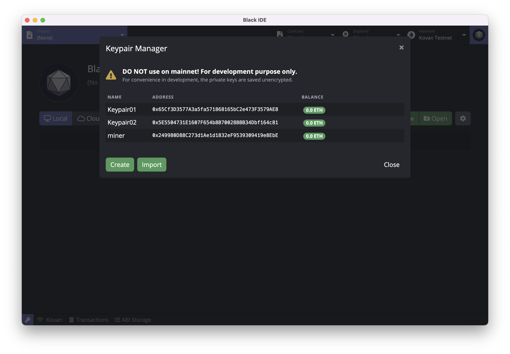
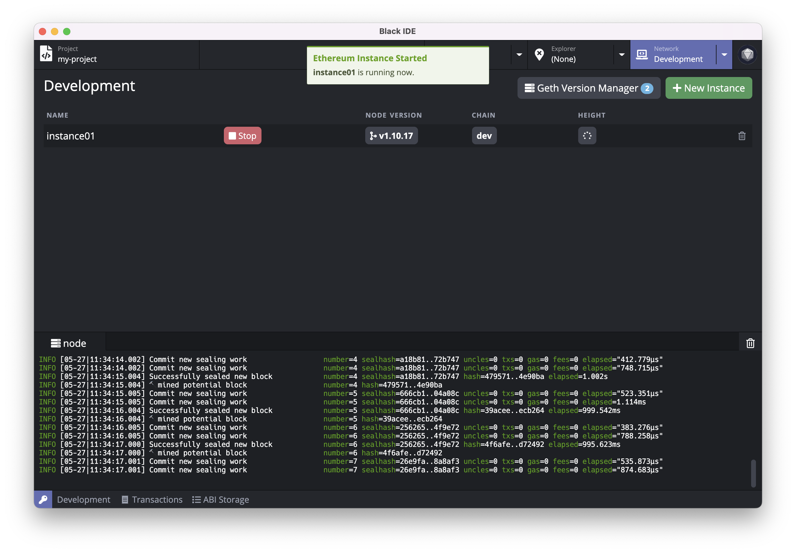

# Ethereum Studio

Ethereum Studio 是一个帮助开发者快速开发 [Ethereum](https://ethereum.org/) 智能合约的集成化开发环境。

## 安装

### 下载

Ethereum Studio 安装包可以在 [Github Releases](https://github.com/ObsidianLabs/EthereumStudio/releases) 进行下载。目前 Ethereum Studio 支持 macOS, Linux 和 Windows 系统，请根据系统下载对应的版本 (macOS 下载 .dmg 或者 .zip，Linux 下载 .AppImage, Windows 下载 .exe)。

### 安装

- **macOS**: 双击打开 `EthereumStudio-x.x.x.dmg` 并将 `Ethereum Studio` 拖动到应用文件夹内。
- **Linux**: 双击打开 `EthereumStudio-x.x.x.AppImage`, 选择 *Properties* => *Permissions* => *Execute*, 将 *Allow executing file as progrom* 选项打勾。关闭属性设置窗口并双击打开应用（不同的 Linux 发行版可能会有不同的安装方式）。
- **Windows**:  双击打开 `EthereumStudio-x.x.x.exe`。

## 功能预览

### 准备工作

在正确安装 Ethereum Studio 并初次启动时，你将看到一个欢迎页面，这里有 Ethereum Studio 正常运行所需要的依赖，包括了 Docker，Ethereum Node 以及 Ethereum Truffle

  

- Ethereum Studio 使用 [**Docker**](https://www.docker.com/) 来启动 Ethereum 节点和进行项目编译。如果你之前没有安装过 Docker，可以点击 *Install Docker* 按钮访问 Docker 官方网站并进行下载安装。
- [**Geth in Docker**](https://hub.docker.com/repository/docker/obsidians/geth) Ethereum 节点镜像，Ethereum Studio 使用这个镜像来运行 Ethereum 节点以及项目编译
- [**Truffle in Docker**](https://hub.docker.com/repository/docker/obsidians/truffle) Ethereum Studio 使用这个工具包进行项目的创建和编译。

当所有依赖都正确安装并运行后，灰色的 *Skip* 按钮将会变成绿色的 *Get Started* 按钮。点击这个按钮进入 Ethereum Studio 的主界面。

### 创建密钥对

进入主界面后，我们需要首先创建一些密钥对。在 Ethereum Studio 的任意界面，点击应用左下⻆的钥匙图标，打开密钥管理器。

  

你可以在密钥管理器中创建、导入并管理密钥对。在创建和编辑密钥对的时候，你可以为该密钥对设置别名，方便在后续的使用中进行识别。密钥管理器除了对密钥对进行储存管理外，还将为创世区块提供创世地址。创建新的 Ethereum 节点实例时，Ethereum Studio 会使用密钥管理器里的地址作为创世地址。

**在继续之前，请先在密钥管理器中创建一些密钥对，作为接下来创建节点实例的创世地址。**

### 启动节点

点击顶部的 *Network* 标签，主页面将切换为网络管理器。在网络管理器中，我们可以进行 Ethereum 节点版本和节点实例的管理，包括下载、删除 Ethereum 节点版本，根据不同版本创建、删除和运行节点实例。

点击主页面中右上角的 *New Instance* 按钮打开创建新实例的弹窗，填写实例名称和选择合适的版本，点击 *Create* 按钮完成节点实例的创建。

  

节点实例创建完成后，实例列表将显示刚刚创建好的实例，点击实例的绿色 *Start* 按钮启动 Ethereum 节点。启动完成后，你可以在下方的日志查看器中检查节点运行日志。

  

### 区块浏览器

节点启动后，点击顶部的 *Explorer* 标签，主页面将切换为区块浏览器。在区块浏览器中，我们可以查询对应地址的信息。

从密钥管理器中复制刚刚生成的地址，将地址粘贴在地址栏并点击回车，我们便可以看到对应地址的余额信息了。

  

### 转账

点击地址栏右边的转账按钮，将会打开转账窗口，输入转账金额及收款人地址，点击 *Sign and Push* 完成转账。

  

### Faucet

在区块链的世界中，大家通常将申请测试 Token 的方式称为 faucet，Ethereum Studio 为不同的测试网络提供便捷的 faucet 入口。切换至不同网络，点击地址栏旁的水龙头按钮将在浏览器中打开当前测试网的 facuet 页面。

### 创建智能合约项目

点击顶部的 *Project* 标签，主页面将切换至项目管理器。点击页面右上角的 *New* 按钮打开创建项目弹窗，输入项目名称并选择合适的模版，Ethereum Studio 目前提供了三个模版：

- `Coin`
- `Open Zeppelin`
- `Metacoin`

选择好模版后可根据需要选择 truffle 版本。

  

### 编译智能合约项目

点击工具栏的编译按钮（锤子形状），Ethereum Studio 将进行项目的编译，你可以通过下方的日志查看器来查看编译结果。编译后将在项目目录下的 `build` 文件夹中生成 json 文件。

  

### 部署智能合约项目

点击工具栏的部署按钮（船形状），部署参数窗口将被打开，在这里可以输入构造函数的参数、交易签名者、gas limit 和 gas price。Ethereum Studio 提供估算 Gas Limit 功能，点击 *Estimate Gas* 将会自动在 Gas Limit 中填入合适的值。

  

点击 *Deploy* 按钮 Ethereum Studio 将进行项目部署，部署结果将会弹窗显示。

  

### 调用合约

成功部署智能合约后，点击弹窗中点击 *Contract* 旁的地址，主页面将切换至合约浏览器，Ethereum Studio 将自动打开刚才部署完成的智能合约。

合约浏览器页面主要分为三个部分：

- 左边为合约的调用方法，点击左边部分的左上角蓝色按钮弹出的下拉框显示当前合约所定义的方法，点击方法名称可以切换调用的方法。
- 中间为合约的数据读取，点击中间部分的左上角蓝色按钮弹出的下拉框显示当前合约的数据表，点击表名称可以切换查看不同表中的数据。
- 右边为合约的事件读取，点击右边部分的左上角蓝色按钮弹出的下拉框显示当前事件，点击事件名称可以切换查看的事件。

Ethereum Studio 会自动读取合约 ABI 中的 functions，并为每个 function 生成参数表单。用户可以简单的选择要调用的 function，输入参数，选择签名者（需要为 keypair manager 中存在的地址；读操作不需选择），并点击运行按钮进行合约调用。调用结果（成功或失败）将显示在下方的 result 栏中。

  

接下来我们使用部署好的合约创建 *Coin*。选择 *mint* 方法，在 *Parameters* 下填入 *receiver* 地址（可以从密钥管理器中复制）和在 *amount* 中填入合适的数量，在 *Authorization* 中填入创世地址，点击上方的执行按钮。完成交易后，我们可以在左下角的 *Result* 中看到成功执行的结果。此时我们已经创建了新的 *Coin*。

在右边的 *balanceOf* 表中，在 Parameters 下输入刚刚填入的 *tokenOwner* 地址，点击执行按钮，便可以看到刚刚 *mint* 的总数了。

  

